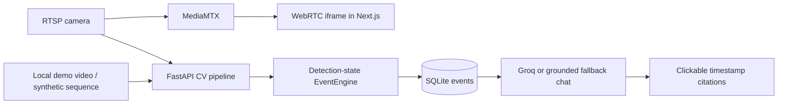

# MemTracker — RTSP CCTV Intelligence with Real-Time CV Tracking and LLM Video Memory Search

MemTracker is a working fullstack AI video intelligence prototype with tested event-engine logic and a demo-video CV pipeline. Users register, attach RTSP cameras, preview browser-safe WebRTC playback through MediaMTX, start AI monitoring, persist timestamped event logs, and ask a grounded Groq-backed assistant what happened with clickable video citations.

## Architecture



RTSP is never rendered directly in the browser. MediaMTX provides browser playback, while RTSP/local video frames feed the CV pipeline and EventEngine.

## Tech Stack

- Frontend: Next.js/React app router
- Backend: FastAPI, SQLAlchemy, SQLite with Postgres-ready relational schema
- CV: OpenCV + cached Ultralytics YOLO loader plus tested detection-state EventEngine
- Streaming: MediaMTX RTSP-to-WebRTC
- Auth: email/password with hashed passwords and localStorage MVP session
- Chat: Groq API when configured, deterministic grounded fallback when missing

## Features

- Landing, login, register, protected dashboard routes.
- Camera attach/list/delete with credential masking and MediaMTX play URLs.
- Monitoring session start/stop/status using a background thread, not the FastAPI event loop.
- Events API with filters for actor, scenario, event type, session, camera, time, and text.
- Logs table with clickable timestamps to `/dashboard/monitor?camera_id=...&t=...`.
- Chat history persistence and citation cards.
- Demo mode camera and sample event fixture.

## Command Summary

| Purpose | Command |
| --- | --- |
| Backend | `cd backend && DEMO_MODE=true uvicorn main:app --reload --port 8000` |
| Frontend | `NEXT_PUBLIC_DEMO_MODE=true npm run dev` |
| Seed demo data | `curl -X POST http://localhost:8000/api/demo/seed` |
| Run demo CV pipeline | `DATABASE_URL=sqlite:///./backend/demo_cv.db python -m backend.run_demo_cv` |
| Event-engine tests | `python -m pytest tests/test_event_engine.py -q` |
| Production frontend build | `npm run build` |

## Demo Script

1. **Start the backend**

   ```bash
   cd backend
   DEMO_MODE=true uvicorn main:app --reload --port 8000
   ```

2. **Start the frontend** from the repository root in a second terminal.

   ```bash
   NEXT_PUBLIC_DEMO_MODE=true npm run dev
   ```

3. **Seed demo data** so logs and chat are immediately populated.

   ```bash
   curl -X POST http://localhost:8000/api/demo/seed
   ```

4. **Run the demo CV/event pipeline** to prove generated events can be produced by the CV layer, not only seeded fixtures.

   ```bash
   DATABASE_URL=sqlite:///./backend/demo_cv.db python -m backend.run_demo_cv
   ```

5. **Open logs** at `http://localhost:3000/dashboard/logs` and filter for `abandoned_object`.

6. **Ask chat** at `http://localhost:3000/dashboard/chat`:

   ```text
   When was a bag abandoned?
   ```

7. **Click the citation** (`00:02:08 abandoned_object`) to open the monitor route with `?t=128.4`. In demo video mode, the player seeks to that timestamp when `public/demo/sample_video.mp4` exists; in live WebRTC mode, the timestamp is shown as an evidence card because live WebRTC has no DVR rewind.

## Verified Evidence

| Evidence | Verified result |
| --- | --- |
| Event-engine tests | `python -m pytest tests/test_event_engine.py -q` → `4 passed` |
| Backend API demo verification | Demo seed, abandoned-object logs, chat query, and chat history returned HTTP 200; chat returned a cited `abandoned_object` event at `00:02:08`. |
| Frontend production build | `npm run build` completed and generated all app routes. |
| Demo CV command | `python -m backend.run_demo_cv` generated `object_pickup`, `abandoned_object`, `suspected_unauthorized_removal`, and `object_handoff` events. |
| Citation behavior | Chat citation links route to `/dashboard/monitor?camera_id=...&t=128.4`. |

## Screenshot Placeholders

Portfolio screenshot checklist: [`docs/screenshots.md`](docs/screenshots.md).

Recommended captures:

- Dashboard overview.
- Streams page with Demo Warehouse Camera.
- Monitor page with selected timestamp evidence.
- Logs page filtered to `abandoned_object`.
- Chat answer with clickable `00:02:08 abandoned_object` citation.

## Assignment Compliance Matrix

| Area | Status |
| --- | --- |
| Auth register/login/409/401 | Implemented |
| Protected dashboard redirect | Implemented in client shell |
| Stream attach validation/duplicates/probe | Implemented |
| Browser never plays RTSP directly | Implemented; live preview uses iframe play_url |
| Monitoring worker threading | Implemented with `threading.Thread` and per-worker DB session |
| YOLO cached outside frame loop | Implemented in `get_cached_yolo_model()` |
| Events filters/timestamps | Implemented |
| Chat grounded on logs/citations/history | Implemented with Groq or fallback |
| Object possession event helpers | Implemented with tested detection-state EventEngine logic |
| SQLite FK cascade | Implemented |


## Verified CV Demo

The CV/event layer is testable without YOLO by feeding normalized detection states into `EventEngine`, and the demo CV command writes generated events into SQLite through the same event pipeline used by monitoring.

Run the synthetic/local-video CV demo from the repo root:

```bash
DATABASE_URL=sqlite:///./backend/demo_cv.db python -m backend.run_demo_cv
```

Verified sample output:

```text
MemTracker demo CV complete
source=demo://sample_video
session_id=1
frames_processed=13
events_detected=4
- 00:00:02 object_pickup: person-1 became associated with backpack object-1.
- 00:00:13 abandoned_object: Backpack object-1 associated with person-1 remained stationary and unattended for 10 seconds.
- 00:00:16 suspected_unauthorized_removal: person-2 picked up unattended backpack object-1; suspected unauthorized removal.
- 00:00:22 object_handoff: Backpack object-1 moved from person-2 to person-3 while both people were nearby.
```

If `public/demo/sample_video.mp4` or `backend/demo/sample_video.mp4` exists, the command reads local video frames. Install `ultralytics==8.3.55` to enable YOLO-backed detection normalization before applying event rules. If no demo video/model is available, it uses a deterministic synthetic detection sequence so the object-possession event engine and DB writes remain verifiable locally.

Run event-engine tests:

```bash
python -m pytest tests/test_event_engine.py -q
```

## Environment Variables

Backend: copy `backend/.env.example` and adjust values.

Frontend: copy `.env.example` and adjust values.

## MediaMTX Setup

See `docs/mediamtx_setup.md`.

## Backend Setup

```bash
cd backend
python -m venv .venv
source .venv/bin/activate
pip install -r requirements.txt
DEMO_MODE=true uvicorn main:app --reload --port 8000
```

Health check:

```bash
curl http://localhost:8000/health
```

Seed demo mode data so logs and chat work immediately:

```bash
curl -X POST http://localhost:8000/api/demo/seed
```

The seed endpoint is idempotent. It creates or reuses `demo@memtracker.local`, creates a `Demo Warehouse Camera`, and inserts the four required sample events if they are missing.

## Frontend Setup

```bash
npm install
NEXT_PUBLIC_DEMO_MODE=true npm run dev
```

Open <http://localhost:3000>. For a production smoke test after `npm run build`, use:

```bash
npm run start
```

## Demo Mode

Set `DEMO_MODE=true` in backend and `NEXT_PUBLIC_DEMO_MODE=true` in frontend. Then call `POST /api/demo/seed` or open the dashboard in frontend demo mode; the dashboard shell will auto-seed a demo user, demo camera, and sample events if no local session exists. Add a real video at `public/demo/sample_video.mp4` for true seeking. Sample event data is also stored in `public/demo/sample_events.json` for reference.

## Known Limitations

- Live WebRTC cannot seek backward without DVR/recording.
- Demo video mode supports true timestamp seeking once `sample_video.mp4` is added.
- Object possession tracking is heuristic-based, tested with synthetic detection states, and may still fail under occlusion or poor detections.
- The system tracks anonymous people such as `person-2`; it does not identify real identities.
- Security events are reported as suspected, not confirmed.

## Future Improvements

- Add migrations with Alembic.
- Add first-class MediaMTX config generation.
- Add recorded HLS/DVR playback for live citation seeking.
- Expand CV tests with synthetic frames.
